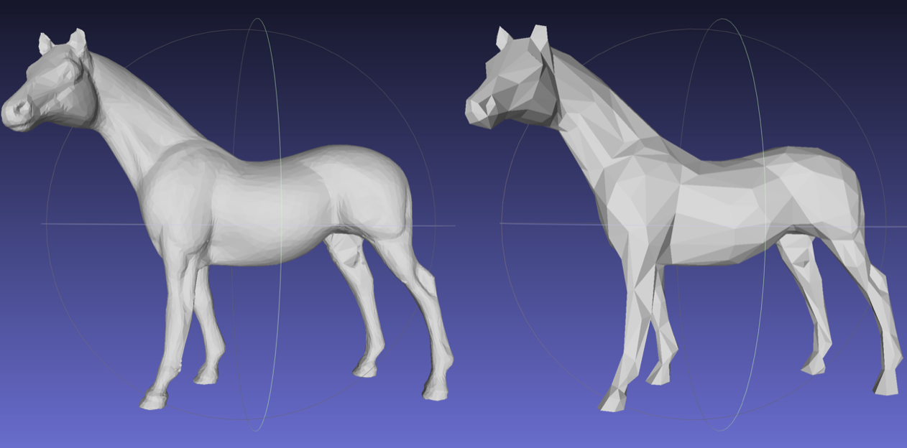
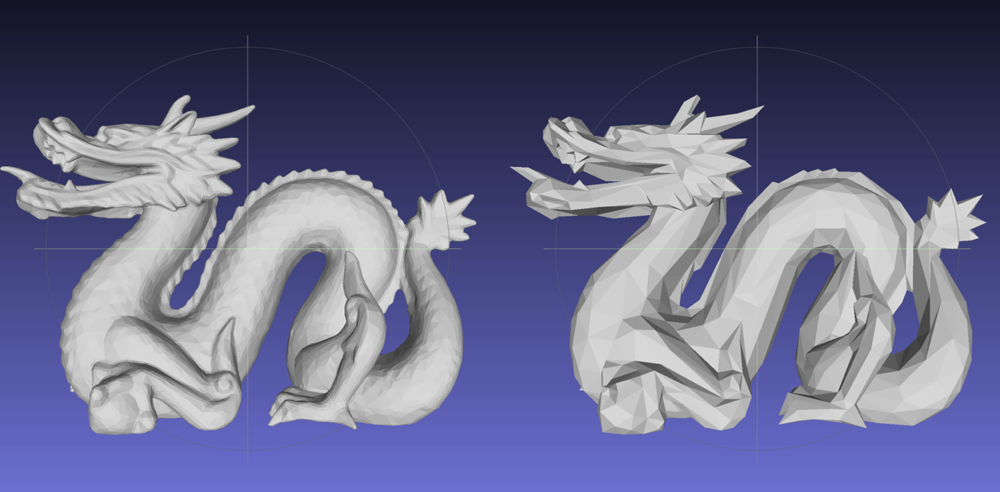

# 网格简化
网格简化-清华大学计算机科学与技术系计算机图形学课程项目

## 基本原理

按照 SIG’97 论文，实现基于边收缩的二次误差网格简化方法。

其核心思想为：通过对网格图形上的每一条边通过计算一个 cost 来维护一个堆，每次迭代都将这个堆中 cost 最小的边将它移除，然后重新计算各条现有边的损失值来维护堆，直到达到给定的简化率为止。

## 使用方法

`./main  in.obj  out.obj  简化比(例如0.01)`

## 考察点说明

在速度方面，使用了最小堆算法进行了复杂度的优化，同时在调试的过程中进行了一些常数级的优化。

网格质量和误差以及拓扑方面，均达到论文中的性能效果，实现了误差度量、拓扑保持等。

当计算中出现收缩点偏离坍塌边过远的情况时，选择中点可以很好的提升性能。

## 效果

下图为简化比为0.1时的效果图：

